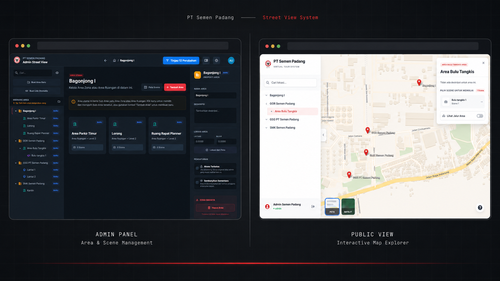

<p align="center">
  
</p>

## Prerequisites

| Software       | Versi Minimum | Catatan                                                               |
| -------------- | ------------- | --------------------------------------------------------------------- |
| **PHP**        | >= 8.2        | Ekstensi wajib: `pdo_pgsql`, `pgsql`, `gd`, `exif`, `mbstring`, `xml` |
| **Composer**   | >= 2.x        | PHP package manager                                                   |
| **Node.js**    | >= 18.x       | Disarankan menggunakan LTS                                            |
| **npm**        | >= 9.x        | Biasanya sudah bundled dengan Node.js                                 |
| **PostgreSQL** | >= 13.x       | Database utama                                                        |
| **PostGIS**    | >= 3.x        | Ekstensi spatial untuk PostgreSQL (WAJIB)                             |

---

## Menjalankan Secara Lokal (Development)

### 1. Ekstrak dan Masuk ke Folder Project

```bash
unzip semen-padang-vr.zip
cd semen-padang-vr
```

### 2. Install Dependencies

```bash
composer install
npm install
```

### 3. Konfigurasi Environment

```bash
cp .env.example .env
```

Edit file `.env` dan sesuaikan konfigurasi database:

```ini
DB_CONNECTION=pgsql
DB_HOST=127.0.0.1
DB_PORT=5432
DB_DATABASE=semen_padang_vr
DB_USERNAME=postgres
DB_PASSWORD=password_anda
```

### 4. Setup Aplikasi

```bash
# Generate application key
php artisan key:generate

# Buat tabel database
php artisan migrate

# Buat storage link untuk akses gambar
php artisan storage:link
```

### 5. Buat Database dengan PostGIS

```sql
-- Jalankan di PostgreSQL
CREATE DATABASE semen_padang_vr;
\c semen_padang_vr
CREATE EXTENSION IF NOT EXISTS postgis;
```

### 6. Jalankan Aplikasi

Buka **3 terminal terpisah**:

| Terminal | Perintah                 | Fungsi                   |
| -------- | ------------------------ | ------------------------ |
| 1        | `npm run dev`            | Frontend dev server      |
| 2        | `php artisan serve`      | Backend dev server       |
| 3        | `php artisan queue:work` | Background job processor |

**Terminal 3 WAJIB!** Tanpa queue worker, upload gambar tidak akan berfungsi.

### 7. Akses Aplikasi

Buka browser: **http://127.0.0.1:8000**

---

## Menjalankan di Server (Production)

### 1. Konfigurasi Environment

Edit `.env` untuk production:

```ini
APP_ENV=production
APP_DEBUG=false
APP_URL=https://yourdomain.com

DB_CONNECTION=pgsql
DB_HOST=127.0.0.1
DB_PORT=5432
DB_DATABASE=semen_padang_vr
DB_USERNAME=your_db_user
DB_PASSWORD=strong_password
```

### 2. Build & Optimasi

```bash
# Build frontend
npm run build

# Optimasi Laravel
php artisan config:cache
php artisan route:cache
php artisan view:cache
composer install --optimize-autoloader --no-dev
```

### 3. Konfigurasi Nginx

```nginx
server {
    listen 80;
    server_name yourdomain.com;
    root /var/www/semen-padang-vr/public;

    index index.php;
    charset utf-8;

    location / {
        try_files $uri $uri/ /index.php?$query_string;
    }

    location ~ \.php$ {
        fastcgi_pass unix:/var/run/php/php8.2-fpm.sock;
        fastcgi_param SCRIPT_FILENAME $realpath_root$fastcgi_script_name;
        include fastcgi_params;
    }

    location ~ /\.(?!well-known).* {
        deny all;
    }
}
```

### 4. Setup Queue Worker (Supervisor)

Buat file `/etc/supervisor/conf.d/semen-padang-worker.conf`:

```ini
[program:semen-padang-worker]
command=php /var/www/semen-padang-vr/artisan queue:work --sleep=3 --tries=3
autostart=true
autorestart=true
user=www-data
redirect_stderr=true
stdout_logfile=/var/www/semen-padang-vr/storage/logs/worker.log
```

Aktifkan:

```bash
sudo supervisorctl reread
sudo supervisorctl update
sudo supervisorctl start semen-padang-worker:*
```

### 5. Set Permissions

```bash
sudo chown -R www-data:www-data /var/www/semen-padang-vr
sudo chmod -R 775 storage bootstrap/cache
```

---

## Setup Akun Admin

Setelah register user pertama, jadikan Super admin via database:

```sql
UPDATE users SET role = 'super_admin', status = 'active' WHERE id = 1;
```

Atau via Tinker:

```bash
php artisan tinker
>>> \App\Models\User::find(1)->update(['role' => 'super_admin', 'status' => 'active']);
```

---

## 🔧 Troubleshooting

| Masalah                       | Solusi                                     |
| ----------------------------- | ------------------------------------------ |
| Gambar tidak muncul           | `php artisan storage:link`                 |
| Upload tidak berfungsi        | Pastikan `php artisan queue:work` berjalan |
| Error "could not find driver" | Install `php-pgsql` dan restart PHP        |
| PostGIS function not found    | `CREATE EXTENSION postgis;`                |
| Vite manifest not found       | `npm run build`                            |

---

<p align="center">
  <i>Dikembangkan untuk PT Semen Padang</i>
</p>
