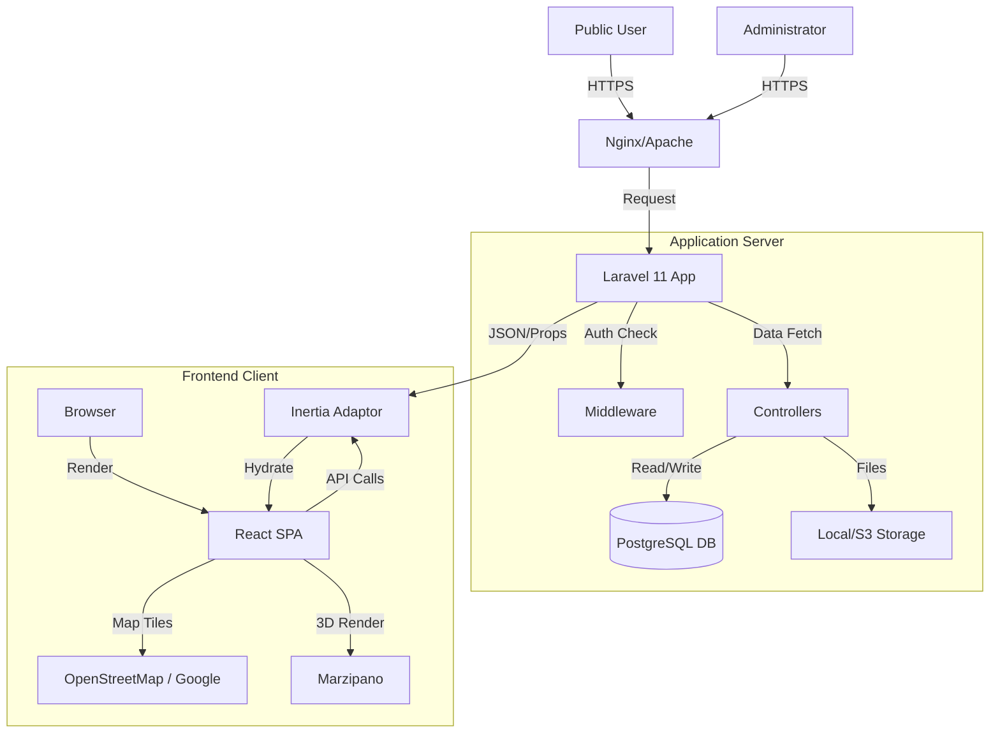

# System Architecture

## 1. High-Level Diagram

## 2. Tech Stack

| Layer         | Technology            | Description                          |
| :------------ | :-------------------- | :----------------------------------- |
| **Frontend**  | React 18              | Component Library & State Management |
| **Logic**     | Inertia.js            | Monolith-to-SPA scaffolding          |
| **Styling**   | TailwindCSS           | Utility framework                    |
| **3D Engine** | Marzipano             | Lightweight 360 viewer               |
| **Maps**      | Leaflet               | Map rendering                        |
| **Backend**   | PHP 8.2+ / Laravel 11 | Core Framework                       |
| **Database**  | PostgreSQL 14+        | Relational Data + PostGIS Extension  |
| **Server**    | Nginx/Apache          | Web Server                           |

## 3. Data Flow

1.  **Request:** User hits `/tour/1`.
2.  **Routing:** Laravel `web.php` routes to `TourController@show`.
3.  **Controller:** Eloquent fetches Scene ID 1, its parent Area, and adjacent Links.
4.  **Response:** Controller returns `Inertia::render('Tour/Viewer', [data])`.
5.  **Frontend:** React hydrates the page. `Viewer.jsx` initializes 3D canvas with the image path provided in props.

## 4. Editing Workflow (Draft System)

To ensure system stability, the architecture implements a **Command Query Responsibility Segregation (CQRS) lite** approach for editing.

-   **Reads (Public):** Direct access to optimized tables.
-   **Writes (Admin):** All writes go to shadow "Draft" tables.
-   **Synchronize:** A specific "Publish" command migrates data from Draft to Live in a single database transaction.
