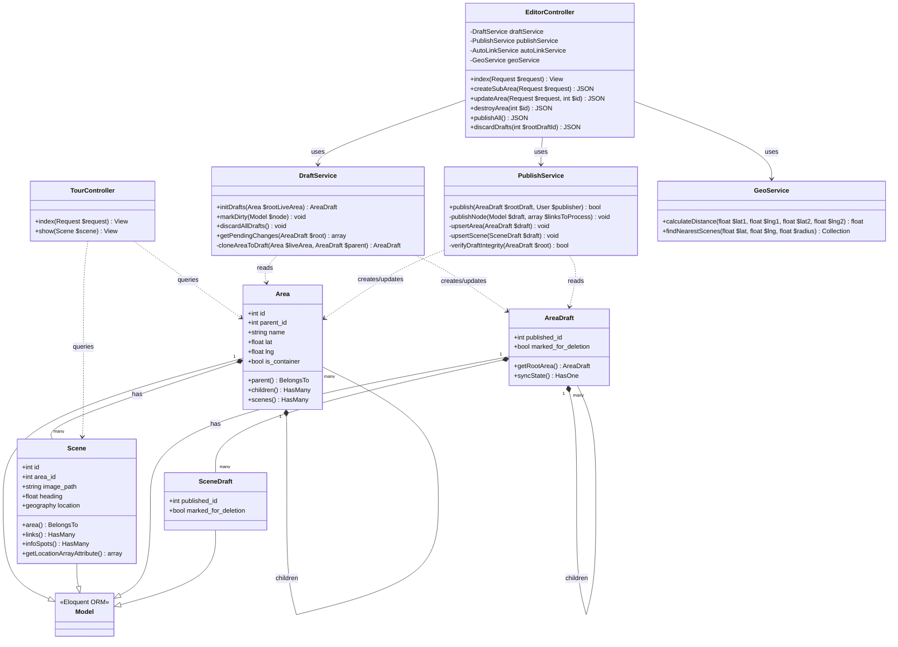

# Class Diagram (UML)

Dokumen ini memuat _Class Diagram_ yang merepresentasikan arsitektur Object-Oriented Programming (OOP) pada _backend_ Semen Padang Virtual Tour. Diagram ini membuktikan pemenuhan **Unit Kompetensi SKKNI - Mengimplementasikan Pemrograman Berorientasi Objek**.

## 1. Arsitektur MVC & Service Pattern

Aplikasi memisahkan tanggung jawab (Single Responsibility Principle) ke dalam lapisan:
1. **Controller:** Menangani _request_ HTTP dan _routing_.
2. **Service:** Menangani logika bisnis kompleks (seperti sinkronisasi _draft_, penghitungan jarak).
3. **Model (Live & Draft):** Representasi entitas di *database* (Active Record / Eloquent).

## 2. Diagram Kelas Utama

## Penjelasan Relasi:
- `TourController` melakukan *query* langsung ke model **Live** (`Area`, `Scene`) untuk disajikan ke publik.
- `EditorController` tidak menyentuh database secara langsung, melainkan menggunakan pola **Dependency Injection** pada `DraftService` dan `PublishService`.
- Model **Draft** mewarisi sifat dari Eloquent `Model` (Inheritance) dan merepresentasikan "Bayangan" dari model **Live** untuk memfasilitasi pengeditan sistem CMS yang aman.
