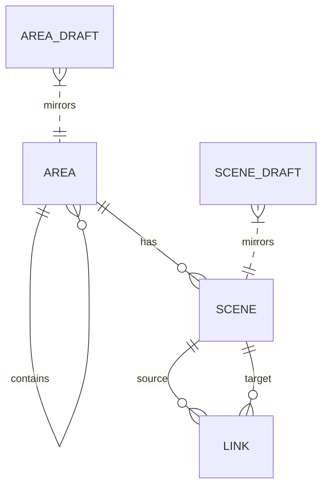

# Database Documentation

## 1. Overview

The database is **PostgreSQL**. The schema is divided into "Live" tables (for public serving) and "Draft" tables (for editing).

## 2. Live Tables (Public)

### `areas`

Represents physical locations (e.g., "Indarung VI", "Packer Room").

-   `id` (PK)
-   `parent_id` (FK -> areas): For hierarchy (Adjacency List model).
-   `name` (string)
-   `level` (tinyint): Depth level (1=Root, 2=Container, 3=Leaf).
-   `is_container` (bool): If true, contains sub-areas. If false, contains scenes.
-   `lat`, `lng` (decimal): Geo-coordinates for the map.

### `scenes`

Represents a single 360° photo point.

-   `id` (PK)
-   `area_id` (FK -> areas)
-   `image_path` (string): Path to storage.
-   `heading` (float): Initial rotation (north offset).
-   `location` (geography): PostGIS point.

### `links`

Represents navigation between scenes.

-   `id` (PK)
-   `source_scene_id` (FK -> scenes)
-   `target_scene_id` (FK -> scenes)
-   `type` (string): 'navigasi' or 'gateway'.
-   `yaw`, `pitch` (double): Position of the hotspot arrow in 3D space.

## 3. Draft Tables (Admin/Editor)

### `area_drafts` / `scene_drafts` / `link_drafts`

Mirrors of the live tables but with additional columns for sync logic:

-   `published_id` (FK): Points to the corresponding Live ID. Null if it's a new unpublished item.
-   `marked_for_deletion` (bool): Soft-delete flag. If true on Publish, the Live item is deleted.

### `draft_sync_states`

Tracks the global state of the draft workspace.

-   `status`: 'synced', 'dirty', 'publishing'.
-   `live_checksum`: Ensures edits are based on the latest version of live data.

## 4. ER Diagram Logic

