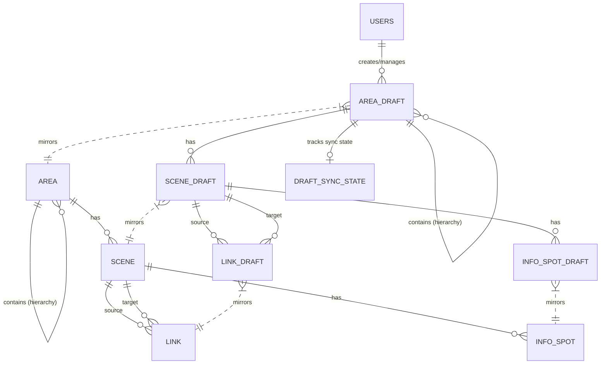

# Database Documentation

## 1. Overview

The database is **PostgreSQL**. The schema is divided into "Live" tables (for public serving) and "Draft" tables (for editing).

## 2. Core Tables & Live Data (Public)

### `users`
Represents the users of the system (Guest, Pegawai, Admin, Super Admin).
- `id` (PK)
- `name` (string)
- `email` (string)
- `status` (string): 'pending', 'active', 'rejected'
- `role` (string): 'guest', 'pegawai', 'admin', 'super_admin'

### `areas`
Represents physical locations (e.g., "Indarung VI", "Packer Room").
- `id` (PK)
- `parent_id` (FK -> areas): For hierarchy (Adjacency List model).
- `name` (string)
- `level` (tinyint): Depth level (1=Root, 2=Container, 3=Leaf).
- `is_container` (bool): If true, contains sub-areas. If false, contains scenes.
- `priority` (integer): For sorting order in UI.
- `lat`, `lng` (decimal): Geo-coordinates for the map.
- `is_restricted` (bool): If true, requires login to view.
- `is_hidden` (bool): If true, completely hidden from public view.

### `scenes`
Represents a single 360° photo point.
- `id` (PK)
- `area_id` (FK -> areas)
- `image_path` (string): Path to storage.
- `heading` (float): Initial rotation (north offset).
- `location` (geography): PostGIS point for spatial operations.
- `can_be_gateway` (bool): If true, can be linked from other areas.

### `links`
Represents navigation between scenes.
- `id` (PK)
- `source_scene_id` (FK -> scenes)
- `target_scene_id` (FK -> scenes)
- `type` (string): 'navigasi' or 'gateway'.
- `yaw`, `pitch` (double): Position of the hotspot arrow in 3D space.
- `distance` (float): Physical distance between source and target.

### `info_spots`
Represents informational hotspots in a scene.
- `id` (PK)
- `scene_id` (FK -> scenes)
- `title` (string): Title of the info spot.
- `description` (text): Detailed description/content.
- `yaw`, `pitch` (double): Position of the info icon in 3D space.

## 3. Draft Tables (Admin/Editor)

### `area_drafts` / `scene_drafts` / `link_drafts` / `info_spot_drafts`
Mirrors of the live tables but with additional columns for sync logic:
- `published_id` (FK): Points to the corresponding Live ID. Null if it's a new unpublished item.
- `marked_for_deletion` (bool): Soft-delete flag. If true on Publish, the Live item is deleted.
- `created_by` (FK -> users): For `area_drafts`, tracks who created the draft.

### `draft_sync_states`
Tracks the global state of the draft workspace.
- `id` (PK)
- `root_draft_id` (FK -> area_drafts)
- `status`: 'synced', 'dirty', 'publishing'.
- `live_checksum`: MD5 hash of live state to ensure edits are based on the latest version.
- `last_synced_at`: Timestamp.

## 4. ER Diagram (Entity Relationship)

