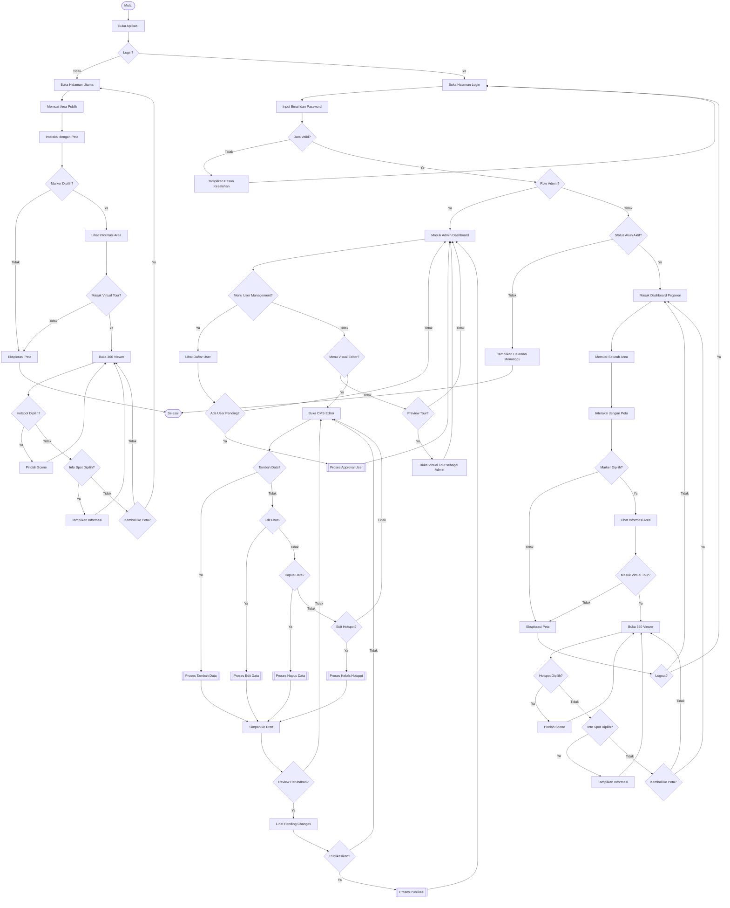

# System Flowchart

Dokumen ini berisi diagram alur (_flowchart_) terintegrasi yang merepresentasikan keseluruhan sistem **Semen Padang Virtual Tour**. Diagram mencakup seluruh peran pengguna (Guest, Pegawai, Admin) dan ketiga domain utama (Public Tour, Admin Dashboard, Visual Editor).

---

## Flowchart Sistem Terintegrasi

---

## Keterangan Simbol

| Simbol    | Nama                 | Keterangan                                                 |
| --------- | -------------------- | ---------------------------------------------------------- |
| `([...])` | _Terminator_         | Awal atau akhir proses (Mulai/Selesai)                     |
| `[...]`   | _Process_            | Proses atau aktivitas tunggal                              |
| `{...}`   | _Decision_           | Keputusan biner (Ya/Tidak)                                 |
| `[[...]]` | _Predefined Process_ | Sub-rutin atau proses kompleks yang didefinisikan terpisah |

---

## Ringkasan Alur Berdasarkan Role

| Role        | Akses Domain                           | Keterangan                                                        |
| ----------- | -------------------------------------- | ----------------------------------------------------------------- |
| **Guest**   | Public Tour                            | Hanya dapat melihat area publik tanpa _login_                     |
| **Pegawai** | Public Tour + Restricted Area          | Dapat melihat seluruh area termasuk yang terbatas setelah _login_ |
| **Admin**   | Admin Dashboard + Visual Editor + Tour | Akses penuh ke manajemen _user_, CMS _editor_, dan _preview_ tour |

---

## Predefined Process Detail

### `[[Proses Approval User]]`

1. Pilih _user_ dengan status _pending_
2. Tentukan: Setujui atau Tolak
3. Jika setujui → Set status aktif
4. Jika tolak → Hapus atau tandai ditolak

### `[[Proses Tambah Data]]`

1. Pilih tipe data (Area / Scene)
2. Isi formulir atau _upload_ gambar 360°
3. Ekstrak _metadata_ GPS (jika ada)
4. Simpan ke _draft_

### `[[Proses Edit Data]]`

1. Pilih item yang akan diedit
2. Ubah properti (nama, koordinat, dll)
3. Simpan ke _draft_

### `[[Proses Hapus Data]]`

1. Pilih item yang akan dihapus
2. Konfirmasi penghapusan
3. Tandai sebagai dihapus di _draft_

### `[[Proses Kelola Hotspot]]`

1. Pilih _scene_ sumber
2. Tambah/edit/hapus _hotspot_ navigasi
3. Tentukan _scene_ tujuan dan posisi (yaw/pitch)
4. Simpan ke _draft_

### `[[Proses Publikasi]]`

1. Validasi seluruh _draft_
2. Eksekusi transaksi atomik ke tabel _live_
3. Bersihkan status _draft_
